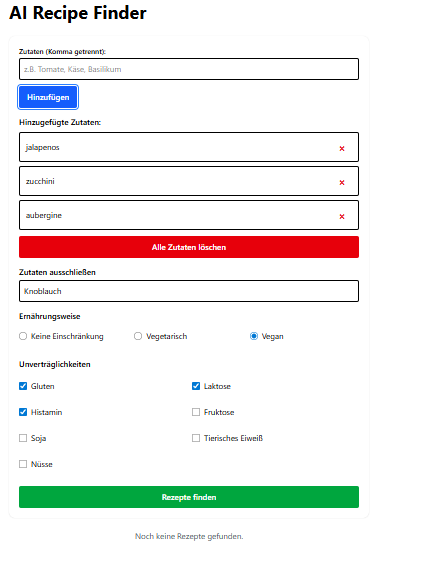
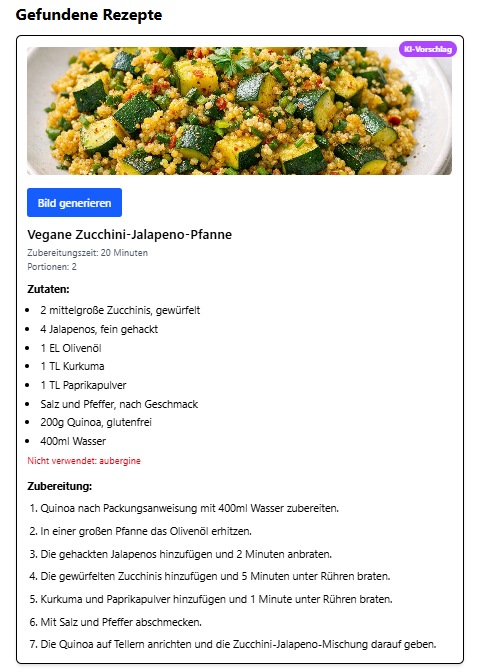

# AI Recipe Finder

Eine Rezept-App, die aus eingegebenen Zutaten passende Rezepte findet. Zusätzlich können Zutaten ausgeschlossen, Unverträglichkeiten ausgewählt und optional vegetarische oder vegane Rezepte gefiltert werden.

Das Projekt ist als Lern- und Portfolio-Projekt entstanden. Der Fokus liegt auf einer verständlichen React-Oberfläche, einer FastAPI-Backendlogik und dem sinnvollen Einsatz von KI-Funktionen.

## Live-Demo

Frontend: https://recipe-ai-app-frontend.onrender.com/

Backend/API: https://recipe-ai-app-pbyc.onrender.com/

Hinweis: Das Backend läuft auf dem Render Free-Tier. Wenn es länger nicht benutzt wurde, kann der erste Request etwa 50 bis 60 Sekunden dauern.

## Screenshots

Eingabe mit Zutaten, ausgeschlossener Zutat, Ernährungsweise und Unverträglichkeiten:



Gefundenes Rezept mit Allergenen, Alternativen und nicht verwendeter Zutat:



## Funktionen

- Zutaten eingeben und passende Rezepte finden
- Eingegebene Zutaten müssen im Rezept vorkommen, außer sie wurden ausgeschlossen oder passen nicht zu einer gewählten Einschränkung
- Zutaten ausschließen
- Ernährungsweise auswählen: keine Einschränkung, vegetarisch oder vegan
- Unverträglichkeiten berücksichtigen, zum Beispiel Gluten, Laktose, Fruktose, Histamin, Soja, Nüsse und tierisches Eiweiß
- Allergene und mögliche Alternativen anzeigen
- KI-Rezept generieren, wenn kein passendes Rezept gefunden wird
- Rezeptbilder generieren oder neu generieren
- Grundlegende Accessibility-Verbesserungen wie Labels, Fieldsets, Skip-Link, Fokus-Stile und Live-Statusmeldungen
- Responsive Oberfläche für Desktop und kleinere Bildschirme

## Tech-Stack

Frontend:

- React
- Vite
- Tailwind CSS
- Fetch API

Backend:

- Python
- FastAPI
- Uvicorn
- Eigene Filterlogik für Zutaten, Unverträglichkeiten, vegetarisch und vegan
- Groq API für KI-Rezepte
- OpenAI API für optionale Bildgenerierung

## Lokal starten

Backend:

```bash
cd backend
uvicorn main:app --reload
```

Optionale Umgebungsvariablen im Backend:

```env
GROQ_API_KEY=dein_key
OAI_API_KEY=dein_key
OPENAI_API_KEY=dein_key
```

Frontend:

```bash
cd frontend
npm install
npm run dev
```

Optionale `.env` im Frontend:

```env
VITE_API_URL=http://127.0.0.1:8000
```

## Manueller Testplan

Da ich noch keine Unit-Tests gelernt habe, teste ich die wichtigsten Funktionen aktuell manuell:

- Zutaten `Tomate` und `Basilikum` eingeben: Es sollen nur Rezepte erscheinen, in denen beide Zutaten sinnvoll vorkommen.
- Zusätzlich `Basilikum` bei ausgeschlossenen Zutaten eintragen: Basilikum darf nicht mehr als Pflichtzutat gelten.
- Vegan auswählen: Rezepte mit Fleisch, Fisch, Ei, Milch oder normalem Käse sollen nicht erscheinen.
- Vegetarisch auswählen: Fleisch und Fisch sollen ausgeschlossen werden.
- `Tomate` eingeben und Histamin auswählen: Tomatenrezepte sollen wegen der Unverträglichkeit nicht vorgeschlagen werden.
- Tastatur-Navigation prüfen: Formularelemente, Buttons und Rezeptkarten müssen erreichbar und sichtbar fokussiert sein.
- Bildgenerierung testen: Bei Fehlern soll eine verständliche Meldung statt eines kaputten Bildes erscheinen.

## Accessibility

Die App enthält mehrere Accessibility-Grundlagen, zum Beispiel:

- sichtbare Labels für Eingabefelder
- gruppierte Radio-Buttons und Checkboxen
- Skip-Link zum Hauptinhalt
- Fokus-Stile für Tastaturbedienung
- Statusmeldungen mit `aria-live`
- Alternativtexte für Bilder
- semantische Überschriften, Listen und Rezeptkarten

Ich würde das Projekt nicht als vollständig WCAG-zertifiziert bezeichnen. Für ein Bewerbungsprojekt ist aber gut erklärbar, welche Accessibility-Punkte bereits umgesetzt wurden und welche man mit mehr Erfahrung noch weiter prüfen würde.

## Aktuelle Grenzen

- Es gibt noch keine Benutzeraccounts oder Favoriten.
- Auf Render kann die App beim ersten Laden langsam reagieren.
- Die KI-Funktionen hängen von gültigen API-Keys und externen Diensten ab.
- Es gibt noch keine automatisierten Unit-Tests. Stattdessen gibt es einen manuellen Testplan, den ich Schritt für Schritt erklären kann.

## Was ich dabei gelernt habe

- React-Komponenten strukturieren
- Formulardaten ans Backend senden
- Backend-Filterlogik mit FastAPI umsetzen
- KI-Funktionen sinnvoll in eine App integrieren
- Grundlegende Accessibility und UX verbessern
- Fehlerfälle verständlicher für Nutzerinnen und Nutzer anzeigen

## Lizenz

MIT
