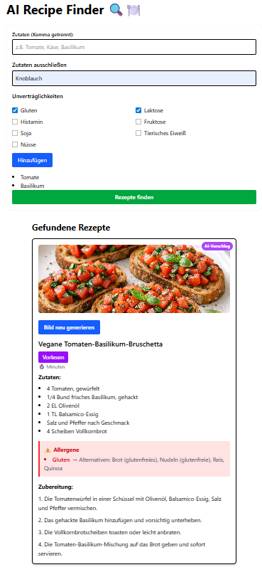

# AI Recipe Finder 🔍🍽️

Eine KI‑gestützte Rezept‑App, die Zutaten analysiert, Allergene erkennt, Alternativen vorschlägt und automatisch passende oder KI‑generierte Rezepte liefert.

Die App kombiniert:

- ein **FastAPI‑Backend** (Python)
- ein **React‑Frontend** (Vite)
- **AI‑gestützte Rezeptgenerierung**
- **Allergen‑ und Intoleranz‑Erkennung**
- **Bildgenerierung**
- **Barrierefreiheit (A11y)**

---

---

## 🚀 Live Demo

### 🔗 Frontend

https://recipe-ai-app-frontend.onrender.com/

### 🔗 Backend (API)

https://recipe-ai-app-pbyc.onrender.com/

**Hinweis:**  
Das Backend schläft im Free‑Tier nach ca. 15 Minuten Inaktivität ein.  
Der erste Request kann daher **3–10 Sekunden** dauern.

---

## 📸 Screenshot



---

## ✨ Features

- **Zutaten eingeben** (mehrere, komma‑getrennt)
- **Zutaten ausschließen**
- **Intoleranzen auswählen** (Gluten, Laktose, Fruktose, Histamin, Soja, Nüsse, tierisches Eiweiß)
- **Allergen‑Erkennung** inkl. Alternativen
- **Fehlende Zutaten** werden automatisch erkannt
- **Match‑Prozentanzeige**
- **KI‑Rezepte**, wenn keine passenden gefunden werden
- **KI‑Bildgenerierung**
- **Vorlesen‑Funktion** (Text‑to‑Speech)
- **Barrierefreiheit**: Skip‑Link, Fokus‑Styles, ARIA‑Labels
- **Responsive UI**

---

## 🧠 Technologie‑Stack

### Backend

- Python 3.11
- FastAPI
- Uvicorn
- difflib (Fuzzy Matching)
- Eigene Allergen‑ und Intoleranz‑Engine
- KI‑Rezeptgenerator

### Frontend

- React (Vite)
- TailwindCSS
- Fetch API
- Screenreader‑Optimierungen

---

## 🚀 Installation

### Backend starten

```bash
cd backend
uvicorn main:app --reload
```

### Frontend

```bash
cd frontend
npm install
npm run dev
```

### Projektstruktur

```js
RECIPE-AI-APP/
│
├── backend/
│ ├── main.py
│ ├── services/
│ └── ...
│
├── frontend/
│ ├── public/
│ │ └── images/
│ ├── src/
│ │ ├── components/
│ │ ├── pages/
│ │ └── App.jsx
│ └── ...
│
└── README.md
```

### Geplante Erweiterungen

- Benutzeraccounts & Favoriten

- Mehrsprachigkeit (DE/EN)

- Export als PDF

- KI‑Modelle für Bilder & Rezepte

## 📄 Lizenz

Dieses Projekt steht unter der MIT-Lizenz.  
Siehe die Datei `LICENSE` für weitere Details.
